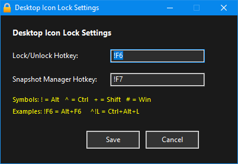
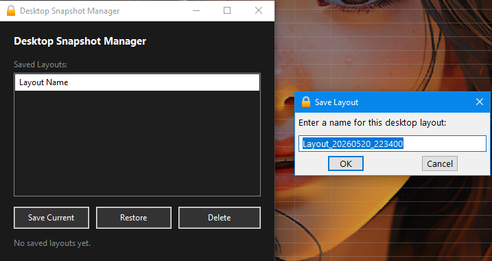
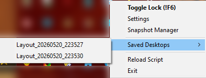

---

## 🖥️ Lock & Restore Desktop Icons

**Ultimate Release — 26-05-20**
*by AndrianAngel*

A lightweight utility that lets you **lock your desktop icon positions** to prevent accidental dragging, and **save/restore named desktop layout snapshots** at any time — all from a system tray icon or keyboard hotkeys.


___

### 🔒LOCK & RESTORE DESKTOP ICONS ULTIMATE
___

## ⚙️Desktop Settings

___

## 🎯Desktop Snapshot Manager

___

## ✅TRAY MENU

___

## 📽️Watch Demo

___

## ✨ Features

### 🔒 Lock / Unlock Desktop Icons
Toggle a desktop icon lock with a single hotkey or tray click. When locked, icons become immovable and the Delete key is blocked on the desktop — preventing any accidental reorganization. Unlocking instantly restores full interactivity and redraws the desktop. The current state is reflected via a tray tip notification.

### 📸 Desktop Snapshot Manager
Save unlimited named desktop layouts and restore them at any time. The Snapshot Manager is a dark-themed GUI with a full list of saved layouts and three actions:

- **Save Current** — prompts for a name (auto-filled with a timestamp default), sanitizes it, and writes the exact pixel position of every desktop icon to an `.ini` file in the `DesktopSnapshots\` folder.
- **Restore** — moves all icons back to their saved positions, matching each icon by name. Confirms before applying.
- **Delete** — permanently removes the selected layout file after confirmation.

The status bar at the bottom shows feedback for every action (saved, restored, deleted, or count of layouts).

### 🗂️ Tray Menu
Right-clicking the tray icon gives quick access to everything:

- **Toggle Lock** — locks or unlocks desktop icons (hotkey shown inline)
- **Settings** — opens the hotkey configuration panel
- **Snapshot Manager** — opens the layout manager GUI
- **Saved Desktops submenu** — lists every saved layout by name; click any entry to restore it instantly with a confirmation prompt
- **Reload Script** — restarts the script
- **Exit** — safely unhooks and exits

The Saved Desktops submenu auto-refreshes whenever a layout is saved or deleted.

### ⚙️ Settings GUI
A dark always-on-top panel lets you remap both hotkeys without editing any file:

- **Lock/Unlock Hotkey** — default `Alt+F6`
- **Snapshot Manager Hotkey** — default `Alt+F7`

Supports all AHK modifier symbols (`!` Alt, `^` Ctrl, `+` Shift, `#` Win). Settings are saved to `DesktopLockSettings.ini` and hotkeys re-register instantly on save.

---

## 🗂️ File Structure

```
📁 Script Folder
├── Lock_Restore_Desktop_Icons.exe
├── DesktopLockSettings.ini       ← auto-created on first save
└── 📁 DesktopSnapshots\
    ├── MyLayout.ini (can be renamed)
    ├── Work.ini
    └── ...
```

---

## ⌨️ Default Hotkeys

| Action | Hotkey |
|---|---|
| Toggle Lock / Unlock | `Alt + F6` |
| Open Snapshot Manager | `Alt + F7` |

> Both hotkeys are fully rebindable from the Settings GUI.

---

## 🔧 Requirements

- Windows 10 / 11

---

## 📌 Notes

- Icon positions are saved and restored **by icon name**, so renaming desktop items may affect layout accuracy.
- Locking uses a low-level Windows hook and the `WS_DISABLED` window style on the desktop ListView — no third-party dependencies.
- On exit, the keyboard hook is automatically cleaned up to prevent any system-level interference.
